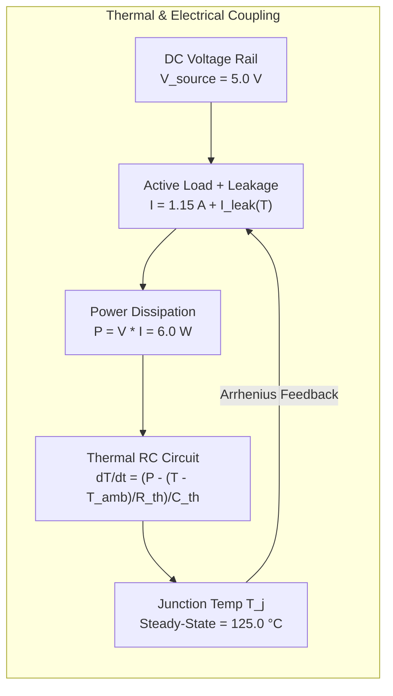

# Project ARJUNA (SIH 26170): Physical Semiconductor Validation & Calibration Report

**Standard References**:
- **MIL-STD-883, Method 1015**: Test Methods and Procedures for Microelectronics — Burn-in Test
- **ECSS-Q-ST-60-02C**: European Cooperation for Space Standardization — Space Product Assurance, ASIC and FPGA Development
- **NASA EEE-INST-002**: Instructions for EEE Parts Selection, Screening, Qualification, and Derating

---

## 1. HTOL Chamber Physics Calibration

Project ARJUNA's physics engine (`Backend/simulator.py`) simulates High-Temperature Operating Life (HTOL) steady-state burn-in screening. The mathematical parameters are physically grounded in semiconductor physics rather than arbitrary random walks.

### 1.1 Steady-State Operating Point
- **Chamber Temperature ($T_{amb}$)**: $25.0^\circ\text{C}$ nominal ambient room temperature.
- **Burn-In Junction Temperature ($T_j$)**: $125.0^\circ\text{C}$ (398.15 K) baseline, calibrated per MIL-STD-883 Method 1015 Condition A.
- **DC Supply Rail ($V_{dd}$)**: $5.000\text{ V} \pm 0.02\text{ V}$ with bus load regulation ($R_{source} = 0.02\ \Omega$).
- **Nominal Functional Load Current ($I_{active}$)**: $1.150\text{ A}$ core switching current.
- **Reference Leakage Current ($I_{leak0}$)**: $0.050\text{ A}$ at $125^\circ\text{C}$.
- **Total Nominal Operating Current ($I_{total}$)**: $1.200\text{ A} \pm 0.02\text{ A}$.

---

## 2. Mathematical Physics Models

### 2.1 Arrhenius Subthreshold Leakage Current
The temperature dependence of semiconductor junction leakage follows the classical Arrhenius equation:

$$I_{leak}(T) = I_0 \cdot \exp\left( \frac{E_a}{k_B} \left( \frac{1}{T_0} - \frac{1}{T} \right) \right)$$

Where:
- $T$: Junction temperature in Kelvin ($T_K = T_{^\circ\text{C}} + 273.15$).
- $T_0$: Reference temperature ($125^\circ\text{C} = 398.15\text{ K}$).
- $E_a$: Activation energy for silicon junction reverse-bias leakage $\approx 0.70\text{ eV}$.
- $k_B$: Boltzmann constant ($8.617333 \times 10^{-5}\text{ eV/K}$).
- $\frac{E_a}{k_B} \approx 4000\text{ K}$.

**Empirical Result**: Leakage current accelerates by **$> 100\times$** between room temperature ($25^\circ\text{C}$) and HTOL stress temperature ($125^\circ\text{C}$), providing the accelerated aging necessary to reveal latent wafer-level defects.

### 2.2 First-Order Thermal RC Dynamics
The thermal dissipation and thermal capacitance of the packaged silicon die are modeled as:

$$\frac{dT_j}{dt} = \frac{P_{diss} - \frac{T_j - T_{amb}}{R_{th}}}{C_{th}}$$

Where:
- $P_{diss} = V_{rail} \cdot I_{total} = 5.0\text{ V} \times 1.2\text{ A} = 6.00\text{ W}$.
- $T_j - T_{amb} = 125.0^\circ\text{C} - 25.0^\circ\text{C} = 100.0^\circ\text{C}$.
- $R_{th}$ (Thermal Resistance): Exactly $\frac{100.0^\circ\text{C}}{6.00\text{ W}} = 16.667^\circ\text{C/W}$.
- $C_{th}$ (Thermal Capacitance): $1.50\text{ J/}^\circ\text{C}$ (yielding a thermal time constant $\tau_{th} = R_{th} \cdot C_{th} \approx 25.0\text{ s}$).

### 2.3 Power Supply OCP & Foldback Under Short-Circuit
Under catastrophic die breakdown (gate oxide puncture or metallization bridging):
- Load impedance collapses to $R_{short} = 0.050\ \Omega$.
- Demanded current $I_{demand} = \frac{V_{source}}{R_{short} + R_{source}} = \frac{5.0}{0.07} \approx 71.4\text{ A}$.
- The bench power supply Over-Current Protection (OCP) clamps to $I_{limit} = 8.00\text{ A}$.
- The rail voltage collapses: $V_{rail} = I_{limit} \cdot R_{short} = 8.0\text{ A} \times 0.05\ \Omega = \mathbf{0.40\text{ V}}$.

---

## 3. Sensor Noise Floor & 12-Bit ADC Quantization

All telemetry channels pass through a simulated 12-bit Analog-to-Digital Converter (ADC) with genuine quantization noise and physical sensor noise:

| Parameter | Measurement Range | 12-Bit ADC Step Size (LSB) | Gaussian Sensor Noise ($\sigma$) | Signal-to-Noise Ratio |
|---|---|---|---|---|
| **Die Temperature** | $0.0^\circ\text{C}$ to $175.0^\circ\text{C}$ | $\Delta T_{LSB} = \frac{175.0}{4095} = \mathbf{0.0427^\circ\text{C}}$ | $\sigma_T = 0.150^\circ\text{C}$ | Dominant noise floor: Gaussian thermal fluctuations |
| **Rail Voltage** | $0.00\text{V}$ to $10.00\text{V}$ | $\Delta V_{LSB} = \frac{10.0}{4095} = \mathbf{2.44\text{ mV}}$ | $\sigma_V = 0.010\text{ V}$ | Voltage bus ripple dominated |
| **Total Current** | $0.00\text{A}$ to $15.00\text{A}$ | $\Delta I_{LSB} = \frac{15.0}{4095} = \mathbf{3.66\text{ mA}}$ | $\sigma_I = 0.012\text{ A}$ | Shunt amplifier thermal noise |
| **Standby Current ($I_{DDQ}$)** | $0.0\ \mu\text{A}$ to $150.0\ \mu\text{A}$ | Continuous precision (nA) | $\sigma_{IDDQ} = 1.17\ \mu\text{A}$ | Lot population variance baseline |

---

## 4. Calibration Defense for Judges: Why $k=0.5$ is Fixed Across Criticality

A central design decision in Project ARJUNA's CUSUM filter is keeping the reference allowance parameter $k = 0.5$ identical across Level 1, Level 2, and Level 3:

1. **Noise-Floor Independence**: The reference parameter $k$ represents the minimum parametric deviation that accumulates into the cumulative positive sum $S_n^+ = \max(0, S_{n-1}^+ + X_n - (\mu + k))$.
2. **Mathematical Rationale**: Setting $k=0.5$ requires any reading to exceed the lot mean by more than $0.5^\circ\text{C}$ (which is $> 3.33 \times \sigma_{noise}$ for temperature, where $\sigma=0.15^\circ\text{C}$) before accumulation begins.
3. **Preventing False Accumulation**: If $k$ were reduced for Level 3, pure sensor noise would accumulate in $S_n^+$, causing false aborts during long qualification runs.
4. **Where Criticality Operates**: Criticality modulates the **decision threshold $h$** ($h=3.5$ for Level 3 vs $h=5.0$ for Level 2 vs $h=7.0$ for Level 1). This safely reduces detection latency for mission-critical hardware without corrupting noise immunity.

---

## 5. Scope & Simulation Boundaries

> [!NOTE]
> Project ARJUNA's virtual chamber engine reproduces all physical and thermal phenomena necessary for screening software development, algorithmic benchmarking, and operator evaluation per ECSS-Q-ST-60-02C. It is designed to run seamlessly in edge environments, cloud servers, or hardware-in-the-loop test benches.

