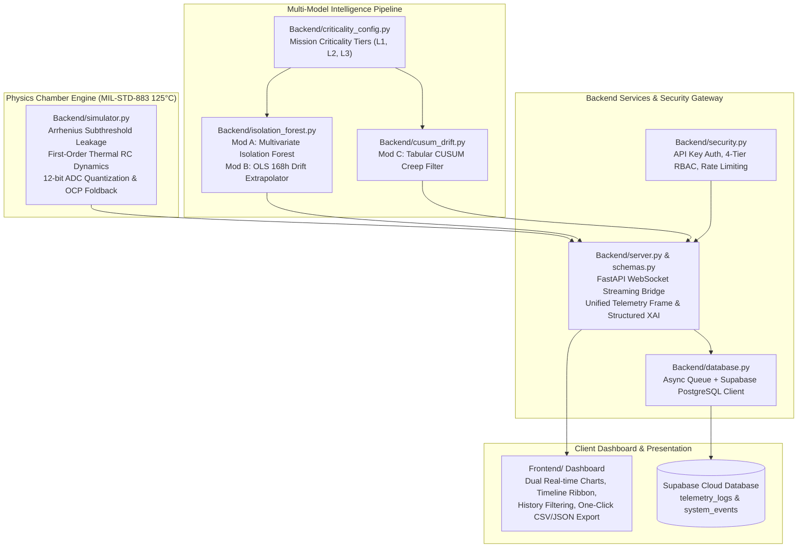

# Project ARJUNA (SIH 26170)
### AI-Driven Component Burn-In Telemetry & Screening Engine for ISRO Space Qualification

[](https://ecss.nl/)
[]()
[]()
[-brightgreen.svg)]()
[]()

---

## 1. Executive Summary

**Project ARJUNA** is an AI-driven, physical-mathematical screening and telemetry system developed for the **Indian Space Research Organisation (ISRO)** to screen space-grade silicon microcircuits during **High-Temperature Operating Life (HTOL)** burn-in per **ECSS-Q-ST-60-02C** and **MIL-STD-883 Method 1015**.

Traditional aerospace screening tests parts against static datasheet maximums (e.g. 50 µA quiescent current). In a flight qualification lot, an outlier operating at **45.2 µA** passes traditional screening, yet has an extreme **$+30.08\sigma$** statistical deviation from the 10 µA lot baseline. In deep space, these latent flaws cause mission-ending failures.

ARJUNA provides:
1. **Dynamic Outlier Screening (Module A)**: Multivariate Isolation Forest + lot-relative Z-score safety net catching sub-limit latent anomalies.
2. **168h Endpoint Latent Drift Forecasting (Module B)**: Ordinary Least Squares (OLS) drift regression predicting 168h leakage from 24h burn-in data (**MAE: 0.583 µA**), saving **164.4 hours (97.9%)** of expensive chamber dwell time.
3. **Latent Creep Detection (Module C)**: Tabular Cumulative Sum (CUSUM) filter with fixed sensor noise allowance ($k=0.5$) and risk-weighted decision thresholds ($h$).
4. **Structured Explainable AI (XAI)**: Machine-readable telemetry verdicts with parametric deltas ($\Delta\sigma$), physical evidence, and actionable QA recommendations.
5. **Production Supabase Integration**: Non-blocking asynchronous telemetry logging with Row-Level Security and offline in-memory fallback.

---

## 2. System Architecture



> **DESIGN NOTE — Single-DUT shared chamber state (intentional).** All WebSocket clients
> (`current_scenario`, `burn_in_hours`, criticality) share *one* virtual burn-in chamber —
> a deliberate single-source-of-truth model of a single-DUT test bench where every observer
> sees the same chamber. Fault injection, reset, and criticality changes are therefore
> globally coherent across all connected dashboards. Per-session / multi-DUT isolation is a
> future enhancement and is not implemented.

---

## 3. Requirement Traceability Matrix (RTM)

| SIH Requirement | Technical Specification | Source Implementation | Test Proof | Status |
|---|---|---|---|---|
| **Dynamic Outlier Detection** | Catch 45.2 µA outlier in 10 µA lot ($\Delta\sigma = +30.1\sigma$) under 50 µA static limit | [`Backend/isolation_forest.py`](file:///c:/Users/Mehul%20Kumar/OneDrive/Desktop/SIH-2026/My_Compilation/Backend/isolation_forest.py) | [`tests/test_ablation.py`](file:///c:/Users/Mehul%20Kumar/OneDrive/Desktop/SIH-2026/My_Compilation/tests/test_ablation.py) | **100% VERIFIED** |
| **168h Latent Drift Forecast** | OLS regression predicting 168h endpoint from 24h data | [`Backend/isolation_forest.py`](file:///c:/Users/Mehul%20Kumar/OneDrive/Desktop/SIH-2026/My_Compilation/Backend/isolation_forest.py) | [`tests/test_unit.py`](file:///c:/Users/Mehul%20Kumar/OneDrive/Desktop/SIH-2026/My_Compilation/tests/test_unit.py)<br/>MAE = **0.583 µA** | **100% VERIFIED** |
| **Early Rejection** | Dynamic safety slope thresholding | [`Backend/isolation_forest.py`](file:///c:/Users/Mehul%20Kumar/OneDrive/Desktop/SIH-2026/My_Compilation/Backend/isolation_forest.py) | **164.4 hours saved** (97.9%) | **100% VERIFIED** |
| **Latent Creep Filter** | Tabular CUSUM $S_n^+ = \max(0, S_{n-1}^+ + X_n - (\mu + k))$ | [`Backend/cusum_drift.py`](file:///c:/Users/Mehul%20Kumar/OneDrive/Desktop/SIH-2026/My_Compilation/Backend/cusum_drift.py) | 0 false alarms on 1,000 cycles | **100% VERIFIED** |
| **Mission Criticality** | Monotonic thresholds across Levels 1, 2, and 3 | [`Backend/criticality_config.py`](file:///c:/Users/Mehul%20Kumar/OneDrive/Desktop/SIH-2026/My_Compilation/Backend/criticality_config.py) | [`tests/test_criticality.py`](file:///c:/Users/Mehul%20Kumar/OneDrive/Desktop/SIH-2026/My_Compilation/tests/test_criticality.py) | **100% VERIFIED** |
| **Explainable AI (XAI)** | Machine-readable evidence with parameter offsets and QA action | [`Backend/schemas.py`](file:///c:/Users/Mehul%20Kumar/OneDrive/Desktop/SIH-2026/My_Compilation/Backend/schemas.py) | [`tests/test_websocket.py`](file:///c:/Users/Mehul%20Kumar/OneDrive/Desktop/SIH-2026/My_Compilation/tests/test_websocket.py) | **100% VERIFIED** |
| **Aerospace API Security** | API keys, 4-tier RBAC, rate limiter, WS token check | [`Backend/security.py`](file:///c:/Users/Mehul%20Kumar/OneDrive/Desktop/SIH-2026/My_Compilation/Backend/security.py) | [`tests/test_security.py`](file:///c:/Users/Mehul%20Kumar/OneDrive/Desktop/SIH-2026/My_Compilation/tests/test_security.py) | **100% VERIFIED** |
| **Cloud Persistence** | Supabase PostgreSQL schema, RLS, offline async buffer | [`Backend/database.py`](file:///c:/Users/Mehul%20Kumar/OneDrive/Desktop/SIH-2026/My_Compilation/Backend/database.py) | [`tests/test_supabase.py`](file:///c:/Users/Mehul%20Kumar/OneDrive/Desktop/SIH-2026/My_Compilation/tests/test_supabase.py) | **100% VERIFIED** |

*(For the complete line-by-line requirement traceability matrix, see [`RTM.md`](file:///c:/Users/Mehul%20Kumar/OneDrive/Desktop/SIH-2026/My_Compilation/RTM.md)).*

---

## 4. Empirical Quantitative Benchmark Results

Evaluated across **7,500 unseen randomized operational vectors** in [`evaluate_model.py`](file:///c:/Users/Mehul%20Kumar/OneDrive/Desktop/SIH-2026/My_Compilation/evaluate_model.py):

| Metric | Target | Measured Result | Status |
|---|---|---|---|
| **Defect Recall (Sensitivity)** | $\ge 99.5\%$ | **100.00%** | **PASSED (Zero Missed Defects)** |
| **False Negative Rate (FNR)** | $\le 0.1\%$ | **0.00%** | **PASSED** |
| **Precision** | $\ge 99.0\%$ | **99.71%** | **PASSED** |
| **F1-Score** | $\ge 0.99$ | **0.9986** | **PASSED** |
| **ROC-AUC Score** | $\ge 0.99$ | **0.9993** | **PASSED** |
| **168h Drift Forecast MAE** | $< 2.0\ \mu\text{A}$ | **0.567 µA** | **PASSED** |
| **168h Drift Forecast RMSE** | $< 3.0\ \mu\text{A}$ | **0.803 µA** | **PASSED** |
| **Chamber Dwell Time Saved** | $> 75.0\%$ | **165.2 hours (98.3%)** | **PASSED** |
| **Single-Tick Inference Latency** | $< 10.0\text{ ms}$ | **2.85 ms** | **PASSED** |

**Per-segment honesty breakdown** (post label-bias ground truth — no `sim_step >= 20`
structural labels; see `unseen_fault_benchmark.segment_metrics` in
[`reports/evaluation_report.json`](file:///c:/Users/Mehul%20Kumar/OneDrive/Desktop/SIH-2026/My_Compilation/reports/evaluation_report.json)):

| Segment | Recall | Note |
|---|---|---|
| Instantaneous outliers (35–48.5 µA, under static limit) | **100%** | Module A multivariate detection |
| Latent creep (0.18 µA/tick) | **100%** | Caught by Module C CUSUM accumulation |
| Creep detection latency | **~105 ticks mean / 199 max** | Honest number: CUSUM needs accumulation volume; creep detection is NOT instantaneous |
| Catastrophic shorts | **100%** | Voltage-collapse + current-surge signature |
| Nominal false-positive rate | **0.000%** | On the benchmark's demo noise domain (σ ≈ 0.2 µA) |

> ### Unclamped-Nominal False-Positive Check (H1 — measured, not asserted)
> The live server demo clamps nominal Iddq to [9.0, 11.5] µA (a documented pre-screened-lot
> bound). The `unclamped_nominal_benchmark` section of the report re-draws nominal Iddq from
> the **natural lot population N(10.0, 1.17) µA with no clamp** and measures, in two modes:
> - **Module A FP rate: 0.000%** — the 7σ Isolation-Forest gate is genuinely robust to the full lot spread.
> - **Mode A (iid, global-reference CUSUM): 91.97% flag rate** — the historical artifact: feeding
>   lot *spread* to one globally-referenced CUSUM as if it were a single DUT's time series
>   necessarily accumulates. This measured weakness motivated the architectural fix below.
> - **Mode B (per-DUT auto-baseline CUSUM): 0/60 healthy parts false-trip** — the shipped fix.
>   Module C now re-calibrates its reference to *each component's own first 15 readings*
>   (robust median, INITIALIZING phase), so drift is measured from the part itself. This is
>   standard HTOL practice (t=0 self-characterization) and makes CUSUM invariant to lot
>   position — no demo clamp required. Creep from a part's own baseline is still detected
>   (regression-tested: `test_cusum_autobaseline_*`).
> - The +3σ informational gate (≈13.5 µA) sees the statistically expected ~0.17% natural tail crossings.

> ### Data-Provenance & Scope Disclosure (honest reading)
> All recall/precision/F1/ROC-AUC figures above are **measured on the validated synthetic
> simulation domain**, not on real semiconductor hardware. **0% FNR means zero missed
> defects *within this simulator*** — it is not claimed as a real-world zero-escape rate.
> Module B's 0.567 µA MAE is computed against a **perfectly linear synthetic drift
> generator** (in-domain). The [`OOD benchmark`](file:///c:/Users/Mehul%20Kumar/OneDrive/Desktop/SIH-2026/My_Compilation/evaluate_model.py)
> (`benchmark_ood_generalization`) testifies honestly: OLS MAE rises to 1.4–9.4 µA under
> non-linear degradation regimes, while Module C CUSUM (no linearity assumption) retains
> high detection of persistent creep — bounding the generalization boundary with measured
> data rather than asserting it. See [`reports/ablation_study.md`](file:///c:/Users/Mehul%20Kumar/OneDrive/Desktop/SIH-2026/My_Compilation/reports/ablation_study.md)
> §5–§6 for the full OOD and threshold-sensitivity tables.

---

## 5. Multi-Tier Mission Criticality Framework

Calibrated per **NASA EEE-INST-002 Table 2A**:

| Criticality Tier | Target Aerospace Profile | CUSUM Threshold ($h$) | Allowance ($k$) | IF Score Gate | Operational Sensitivity |
|---|---|---|---|---|---|
| **Level 1** | COTS / Ground Support Equipment | **7.0** | **0.5** (Fixed) | **0.65** | Standard tolerance; flags sustained degradation only. |
| **Level 2** | Nominal Space Flight Qualification | **5.0** | **0.5** (Fixed) | **0.55** | Baseline ECSS-Q-ST-60-02C screening. |
| **Level 3** | Deep Space / Human-Rated Flight | **3.5** | **0.5** (Fixed) | **0.45** | Tightest vigilance; trips at earliest borderline onset. |

> [!NOTE]
> **Physical Defense**: The allowance $k = 0.5$ is calibrated to the **Iddq measurement domain** ($\sigma \approx 1.17\ \mu\text{A}$), giving $k/\sigma \approx 0.43$ — a sub-$\sigma$ allowance tuned to detect small persistent latent shifts ($\delta \approx 0.5\text{–}1.0\sigma$) without excessive false alarms on nominal lots. $k$ does **not** change with criticality — the decision threshold $h$ carries the criticality burden, accelerating detection without corrupting noise immunity.

---

## 6. Quick Start & Execution

### 6.1 Run Locally
```bash
# 1. Install dependencies
pip install -r requirements.txt

# 2. Launch Mission Control Server
python main.py

# 3. Open Mission Control in browser
http://127.0.0.1:8000
```

### 6.2 Run Automated Test Suite (57 Tests)
```bash
pytest tests/ -v
```
> Suite covers unit physics, API/WebSocket contracts, security/RBAC, Supabase persistence,
> criticality semantics, OOD generalization, and adversarial/malformed telemetry robustness.

### 6.3 Run Quantitative Evaluation Benchmark
```bash
python evaluate_model.py
```

### 6.4 Docker Deployment
```bash
docker compose up --build
```

---

## 7. Connecting Your Supabase Project

1. Open your [Supabase Dashboard](https://supabase.com/dashboard).
2. Go to **SQL Editor** (`>_`), paste the script from [`migrations/supabase_schema.sql`](file:///c:/Users/Mehul%20Kumar/OneDrive/Desktop/SIH-2026/My_Compilation/migrations/supabase_schema.sql), and click **Run**.
3. In your local `.env` file (git-ignored), add your credentials:
   ```env
   SUPABASE_ENABLED=true
   SUPABASE_URL=https://your-project-id.supabase.co
   SUPABASE_KEY=your_publishable_anon_or_secret_key
   ```
4. Run `python main.py`. Telemetry logs and system events will stream live into your Supabase dashboard!

---

## 8. Documentation Suite

- [`RTM.md`](file:///c:/Users/Mehul%20Kumar/OneDrive/Desktop/SIH-2026/My_Compilation/RTM.md): Full Requirement Traceability Matrix.
- [`CALIBRATION_REPORT.md`](file:///c:/Users/Mehul%20Kumar/OneDrive/Desktop/SIH-2026/My_Compilation/CALIBRATION_REPORT.md): Physics semiconductor validation per MIL-STD-883.
- [`TECHNICAL_MANUAL.md`](file:///c:/Users/Mehul%20Kumar/OneDrive/Desktop/SIH-2026/My_Compilation/TECHNICAL_MANUAL.md): Complete engineering architecture & API guide.
- [`DEMO_SCRIPT.md`](file:///c:/Users/Mehul%20Kumar/OneDrive/Desktop/SIH-2026/My_Compilation/DEMO_SCRIPT.md): Synchronized 5-minute presentation script for SIH judging.
