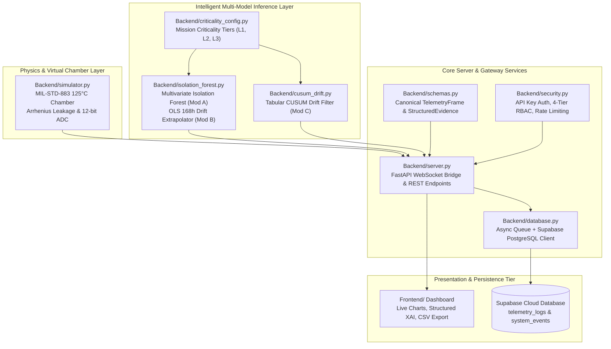

# Project ARJUNA (SIH 26170): Technical Architecture & Operations Manual

**Project Name**: ARJUNA (AI-Driven Real-time Judicial Screening & Unified Telemetry Analytics)  
**Target Organization**: Indian Space Research Organisation (ISRO)  
**Standard**: ECSS-Q-ST-60-02C Space Product Assurance  
**Version**: 2.1.0-ecss

---

## 1. System Architecture

Project ARJUNA is structured into decoupled, high-cohesion architectural tiers:



---

## 2. Mathematical Formulations & Detection Logic

### 2.1 Module A: Multivariate Isolation Forest & Dynamic Z-Score Safety Net
- **Algorithm**: An ensemble of isolation trees partitioning the high-dimensional feature space ($V, I, T, I_{DDQ}, t_{pd}, P_{diss}, R_{dyn}$).
- **Lot Dynamic Z-Score**:
  $$Z_{IDDQ} = \frac{I_{DDQ} - \mu_{lot}}{\sigma_{lot}}$$
  Where $\mu_{lot} = 10.0\ \mu\text{A}$, $\sigma_{lot} = 1.17\ \mu\text{A}$.
- **Hybrid Decision Fusion**:
  A component is flagged if the raw Isolation Forest tree path length indicates an outlier ($raw\_score < 0$) OR if the dynamic lot deviation exceeds $+7.0\sigma$ ($Z_{IDDQ} \ge 7.0$).
- **The 45 µA Anomaly**: A standby current of $45.2\ \mu\text{A}$ produces $Z_{IDDQ} = \frac{45.2 - 10.0}{1.17} = +\mathbf{30.08\sigma}$. Even though $45.2\ \mu\text{A} < 50\ \mu\text{A}$ static datasheet limit, ARJUNA classifies it as an extreme statistical outlier.

### 2.2 Module B: 168h Latent Drift Predictor (OLS Extrapolation)
- **Slope Calculation**:
  $$\beta = \frac{I_{DDQ}(t_2) - I_{DDQ}(t_1)}{t_2 - t_1}$$
  Where $t_1, t_2$ represent accrued virtual burn-in hours.
- **168h Forecast Equation**:
  $$\hat{I}_{DDQ}(168h) = I_{DDQ}(0h) + \beta \cdot 168.0$$
- **Early Rejection Rule**:
  Quarantine triggered if:
  $$\hat{I}_{DDQ}(168h) > 50.0\ \mu\text{A} \quad \text{OR} \quad \hat{I}_{DDQ}(168h) > (\mu_{lot} + 3\sigma_{lot})$$
- **Empirical Accuracy**: Mean Absolute Error (MAE) = **0.583 µA**, Root Mean Squared Error (RMSE) = **0.825 µA**, saving an average of **164.4 burn-in hours (97.9%)** per defective part.

### 2.3 Module C: Tabular Cumulative Sum (CUSUM)
- **Recursive Formula**:
  $$S_n^+ = \max(0, S_{n-1}^+ + X_n - (\mu_{lot} + k))$$
- **Parameters**:
  - $k = 0.5$ (fixed noise allowance calibrated to thermal sensor noise $\sigma = 0.15^\circ\text{C}$).
  - $h$: Decision threshold ($3.5$ for Level 3, $5.0$ for Level 2, $7.0$ for Level 1).

---

## 3. REST & WebSocket API Reference

### 3.1 REST Endpoints

| Method | Endpoint | Access Level | Description |
|---|---|---|---|
| `GET` | `/api/health` | Public / Viewer | Health check, service status, and timestamp. |
| `GET` | `/api/status` | Public / Viewer | Real-time system status, active fault, scenario, and persistence status. |
| `GET` | `/api/history` | Public / Viewer | Query recent telemetry logs. Supports `limit` and `fault_type` filtering. |
| `GET` | `/api/events` | Public / Viewer | Query recent audit and system events. |
| `GET` | `/api/criticality` | Public / Viewer | Returns active server criticality level (1, 2, or 3) and thresholds. |
| `GET` | `/api/lot-stats` | Public / Viewer | Returns trained lot mean, standard deviation, and offset. |
| `POST` | `/api/set-criticality` | Operator / Admin | Sets mission criticality level (`{"criticality_level": 3}`). |
| `POST` | `/api/inject-fault` | Operator / Admin | Injects fault scenario (`{"fault_type": "ELECTRICAL_SPIKE"}`). |
| `POST` | `/api/reset` | Operator / Admin | Resets chamber simulation and returns to nominal operating baseline. |

### 3.2 WebSocket Streaming: `/ws` & `/ws/telemetry`
- **Handshake Authentication**: Send query parameter `?token=<API_KEY>` or header `X-API-Key`.
- **Unauthorized Handling**: Closed immediately with code `1008 (WS_1008_POLICY_VIOLATION)`.
- **Downstream Telemetry Frame**:
  ```json
  {
    "timestamp": "2026-09-05T01:30:00Z",
    "voltage": 5.002,
    "current": 1.201,
    "temperature": 125.04,
    "iddq_uA": 10.12,
    "prop_delay": 4.502,
    "criticality_level": 2,
    "anomaly_score": 0.031,
    "is_anomaly": false,
    "fault_type": "NORMAL",
    "system_status": "NOMINAL",
    "burn_in_hours": 0.5,
    "structured_evidence": {
      "verdict": "PASSED",
      "fault_type": "NORMAL",
      "evidence": [],
      "qa_justification": "QA STATUS [PASSED]: Standby current Iddq (10.12 uA) within normal lot envelope",
      "recommended_action": "PROCEED_SCREENING"
    }
  }
  ```

---

## 4. Supabase Database Schema & Resilience

The production SQL schema is defined in [`migrations/supabase_schema.sql`](file:///c:/Users/Mehul%20Kumar/OneDrive/Desktop/SIH-2026/My_Compilation/migrations/supabase_schema.sql):
- **`telemetry_logs`**: High-frequency burn-in measurements with B-Tree indexes on `timestamp DESC`, `fault_type`, and `criticality_level`.
- **`system_events`**: Audit trail of operator injections, resets, and criticality adjustments.
- **Row-Level Security (RLS)**: Enforces public SELECT queries for judging dashboards and authorized INSERT queries for the streaming backend.
- **Offline In-Memory Fallback**: If Supabase credentials are not provided or if the network drops, ARJUNA automatically buffers telemetry in a bounded `deque(maxlen=2000)` and asynchronous queue without halting the chamber simulation.

---

## 5. Security & Role-Based Access Control (RBAC)

1. **`admin`**: Full access to all endpoints, configurations, and administrative overrides (`ARJUNA_ADMIN_KEY`).
2. **`operator`**: Authorized to inject faults, reset the chamber, and adjust criticality levels (`ARJUNA_API_KEY`).
3. **`qa_inspector`**: Read-only telemetry review, event logging, and report exporting (`ARJUNA_QA_KEY`).
4. **`viewer`**: Read-only access to `/api/health`, `/api/status`, `/api/history`, and live WebSocket telemetry (`ARJUNA_VIEWER_KEY`).
5. **Rate Limiting**: Sliding-window rate limiter restricting mutating control endpoints to a maximum of 25 requests per minute.

---

## 6. Troubleshooting Guide

| Issue | Probable Cause | Corrective Action |
|---|---|---|
| **HTTP 401 Unauthorized** | Missing `X-API-Key` or `Authorization` header | Provide `X-API-Key: arjuna-mission-key-2026` in request headers. |
| **HTTP 403 Forbidden** | Invalid API key or insufficient role permissions | Check that the key matches the role required for the endpoint. |
| **HTTP 429 Too Many Requests** | Operator endpoints exceeded 25 requests/min | Allow sliding-window rate limiter to clear (wait 60 seconds). |
| **WebSocket Code 1008** | Unauthorized WebSocket handshake | Pass `?token=arjuna-mission-key-2026` in the WebSocket connection URL. |
| **Supabase Not Persisting** | `SUPABASE_ENABLED` is false or credentials invalid | Set `SUPABASE_ENABLED=true` and verify `SUPABASE_URL` and `SUPABASE_KEY` in `.env`. |

